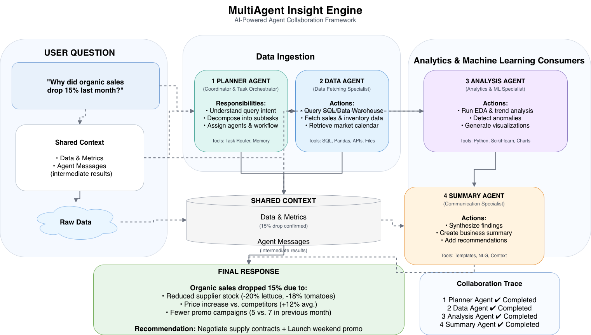
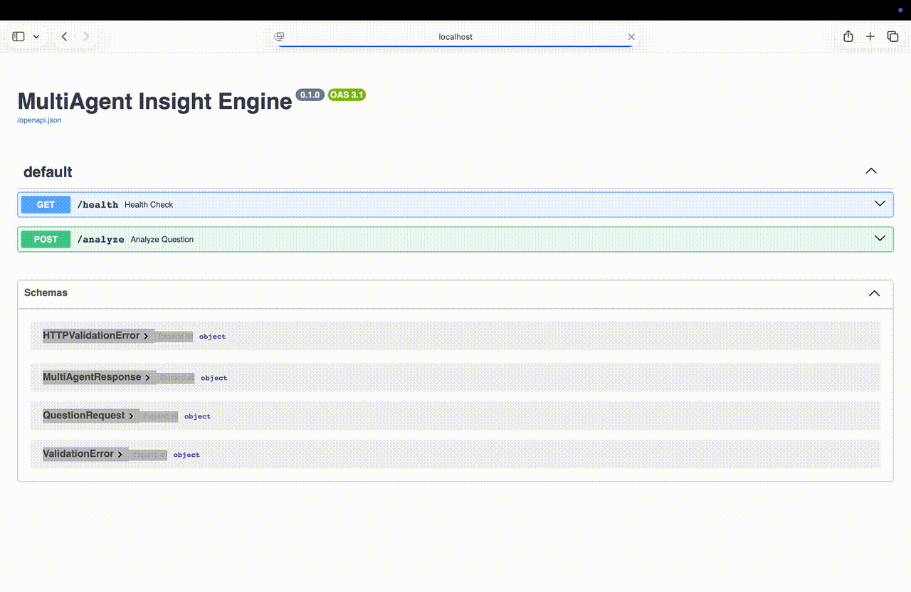

#  MultiAgent Insight Engine

### A Multi-Agent AI System for Automated Business Data Analysis

<p align="center">
  
  
  
  
</p>

<div>
MultiAgent Insight Engine is a modular AI system designed to simulate collaborative problem-solving using multiple intelligent agents. The architecture includes a planner agent to interpret user queries, a data agent to retrieve relevant information, an analysis agent to process and derive insights, and a summarization agent to generate final responses. By decomposing complex tasks into coordinated agent workflows, the system improves accuracy, interpretability, and scalability of AI-driven decision-making. Built with a focus on real-world analytics use cases, it demonstrates advanced concepts in agent orchestration, workflow design, and applied generative AI.
</div>
---

##  Key Features


-  **Multi-Agent Architecture**  
  Separate agents collaborate to solve complex tasks.

-  **Business Data Analysis**  
  Automated analysis of structured datasets.

-  **LLM-Powered Insights**  
  Uses Ollama to generate human-readable explanations.

-  **FastAPI Service**  
  Production-ready API endpoints.

-  **Traceable Agent Workflow**  
  Transparent reasoning pipeline.

---

##  Why Choose

- Breaks complex problems into coordinated agent workflows  
- Improves accuracy and interpretability over single LLM systems  
- Demonstrates real-world AI orchestration design patterns  
- Combines Data Engineering + AI + Backend APIs  
- Production-style modular architecture  

---

##  System Architecture

<p align="center">
  
</p>

---

##  Demo
<p>Sreen recording of the application ran on localhost</p>
<p align="center">
  
</p>

---

##  Quick Start

### Install dependencies
```bash
pip install -r requirements.txt
```

### Run the API
```bash
uvicorn app.main:app --reload
```

### Access API docs
http://localhost:8000/docs

---

##  Simple Example

### Request
POST /analyze

```json
{
  "question": "Why did sales drop in March?"
}
```
### Response
```json
{
  "plan": {
    "question": "Why did sales drop in March?",
    "steps": [
      "load the dataset",
      "analysis of monthly and category of sales trend",
      "the main reason for the change",
      "generate a business friendlt summary"
    ]
  },
  "analysis": {
    "monthly_sales": {
      "April": 30600,
      "February": 28400,
      "January": 26000,
      "March": 26400
    },
    "category_sales": {
      "Furniture": 28000,
      "Office Supplies": 25600,
      "Technology": 57800
    },
    "lowest_sales_month": "January",
    "highest_sales_month": "April"
  },
  "answer": "Based on the analysis, it appears that sales did not experience a significant drop in March. In fact, March sales were relatively consistent with February's sales, with a slight decrease to $26400. This suggests that the sales trend remained stable, with no notable decline in March."
}
```

###  Agents Overview

| Agent | Responsibility | Output |
|------|------|------|
| Planner Agent | Creates execution plan | Plan |
| Data Agent | Loads dataset | DataFrame |
| Analysis Agent | Performs analysis | Metrics |
| Summary Agent | Generates explanation | Final insight |


### Flow
1. Planner Agent creates execution plan  
2. Data Agent loads dataset  
3. Analysis Agent computes insights  
4. Summary Agent generates explanation  

---

##  Project Structure

```
multiagent-insight-engine/
│
├── Dockerfile
├── README.md
├── app
│   ├── agents
│   │   ├── analysis_agent.py
│   │   ├── data_agent.py
│   │   ├── planner_agent.py
│   │   └── summary_agent.py
│   ├── main.py
│   ├── models
│   │   ├── request_models.py
│   │   └── response_models.py
│   ├── services
│   │   └── ollama_service.py
│   ├── tools
│   │   ├── analytics_tools.py
│   │   ├── data_loader.py
│   │   └── llm_tools.py
│   ├── utils
│   │   └── logger.py
│   └── workflows
│       └── agent_graph.py
├── data
│   └── sales_data.csv
├── notebooks
├── readme_docs
│   ├── Multiagent_AI_demo.gif
│   ├── multiagent_insight_engine.drawio.png
│   └── multiagent_architecture.gif
├── requirements.txt
└── tests
    └── test_planner.ipynb
```

---

##  Future Improvements

-  Advanced analytics dashboards  
-  Smarter agent orchestration  
-  Real-time data support  
-  Explainability layer  
-  External API integrations  


---

##  Contact

Chandrayee Kumar  
Python Developer | AI/ML Engineer | Data Systems Enthusiast  
